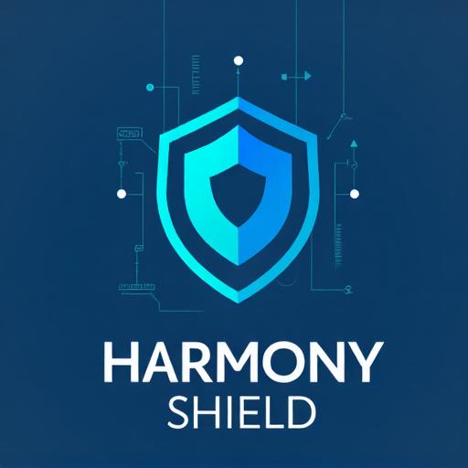

# 🛡️ HarmonyShield - Digital Fraud Protection Platform

<div align="center">



**Advanced AI-Powered Platform for Social Media Fraud Detection & Prevention**

[](LICENSE)
[](https://lovable.dev)
[](https://reactjs.org/)
[](https://www.typescriptlang.org/)
[](https://supabase.com/)

[Live Demo](https://harmonyshield.lovable.app) • [Documentation](#features) • [Report Bug](https://github.com/harmonyshield/issues)

</div>

---

## 📋 Table of Contents

- [About](#about)
- [Key Features](#key-features)
- [Technology Stack](#technology-stack)
- [Getting Started](#getting-started)
- [Project Structure](#project-structure)
- [Core Modules](#core-modules)
- [Security](#security)
- [Deployment](#deployment)
- [Contributing](#contributing)
- [License](#license)

---

## 🎯 About

**HarmonyShield** is a comprehensive digital security platform designed to protect users from social media fraud, phishing attacks, and online scams. Leveraging advanced AI technology, real-time monitoring, and community-driven intelligence, HarmonyShield provides a complete protection suite for individuals and organizations.

### Mission
To democratize advanced security technology and make digital fraud protection accessible to everyone, creating a safer internet ecosystem through AI-powered detection and community collaboration.

### Problem We Solve
- **1M+ scams** detected and prevented
- **50K+ users** protected worldwide
- **99.9% detection rate** for known fraud patterns
- **24/7 monitoring** across all major platforms

---

## ✨ Key Features

### 🤖 AI-Powered Protection
- **Smart Scam Detection**: Advanced machine learning algorithms analyze patterns to detect sophisticated fraud attempts
- **Natural Language Processing**: AI-powered analysis of messages and content for threat detection
- **Behavioral Analysis**: Identifies suspicious patterns in user interactions and transactions
- **Real-time Risk Scoring**: Instant threat assessment with actionable recommendations

### 🔍 Deep Search & Investigation
- **Social Media Deep Lookup**: Comprehensive background checks across multiple platforms
- **Image Reverse Search**: Identify fake profiles and stolen identities
- **Fraud Pattern Analysis**: Cross-reference against global scam databases
- **Fake Profile Detection**: AI-powered indicators for fraudulent accounts

### 🛡️ Security Tools
- **URL Scanner**: Real-time website safety analysis with VirusTotal integration
- **File Scanner**: Malware and threat detection for uploaded files
- **Phishing Detector**: Email and message analysis for phishing attempts
- **AI Security Chat**: Interactive assistant for security consultations

### 💰 Recovery Services
- **Fraud Recovery Assistance**: Professional support for fraud victims
- **Evidence Collection**: Secure documentation and case management
- **Multi-type Support**: Cards, Cash, and Cryptocurrency recovery processes
- **Admin Case Management**: Dedicated recovery team coordination

### 📊 Admin Management System
- **User Management**: Complete user administration and role management
- **Report Management**: Review and verify community-submitted scam reports
- **Bot Management**: AI bot subscriptions and package management
- **Threat Intelligence**: Real-time threat reports and indicators
- **System Monitoring**: Health checks, analytics, and performance tracking
- **Security Center**: Advanced security configurations and audit logs
- **A/B Testing**: Feature experimentation and optimization
- **Integration Config**: API keys and third-party service management

### 🌐 Community Features
- **Smart Feeds**: Real-time news and threat intelligence from verified sources
- **Community Reporting**: User-driven scam database contributions
- **Social Management**: Platform-specific threat monitoring
- **Tracking Links**: Advanced visitor tracking and analytics

### 🔔 Real-time Notifications
- **Instant Security Alerts**: Push notifications for detected threats
- **Activity Monitoring**: Real-time updates on scans and investigations
- **System Notifications**: Important security updates and advisories

---

## 🛠️ Technology Stack

### Frontend
- **React 18.3** - Modern UI library with hooks
- **TypeScript** - Type-safe development
- **Vite** - Lightning-fast build tool
- **Tailwind CSS** - Utility-first styling
- **shadcn/ui** - Beautiful component library
- **Lucide Icons** - Comprehensive icon set

### Backend & Infrastructure
- **Supabase** - PostgreSQL database, authentication, and real-time subscriptions
- **Edge Functions** - Serverless API endpoints (Deno runtime)
- **Row Level Security (RLS)** - Database-level security policies
- **Real-time Subscriptions** - Live data updates

### AI & Security Services
- **OpenAI API** - Advanced language model integration
- **VirusTotal API** - Malware and threat scanning
- **Custom AI Models** - Fraud detection algorithms
- **Hugging Face Transformers** - ML model integration

### State Management & Data
- **TanStack Query** - Server state management
- **React Hook Form** - Form handling
- **Zod** - Schema validation
- **React Router** - Client-side routing

### Development Tools
- **ESLint** - Code linting
- **Git** - Version control
- **GitHub** - Repository hosting and CI/CD

---

## 🚀 Getting Started

### Prerequisites

- **Node.js** (v18 or higher) - [Install with nvm](https://github.com/nvm-sh/nvm#installing-and-updating)
- **npm** or **yarn** package manager
- **Git** for version control
- **Supabase Account** (for backend services)

### Installation

1. **Clone the repository**
   ```bash
   git clone <YOUR_GIT_URL>
   cd harmonyshield
   ```

2. **Install dependencies**
   ```bash
   npm install
   # or
   yarn install
   ```

3. **Set up environment variables**
   ```bash
   # Create .env file (note: this project uses Supabase directly)
   # No VITE_ variables are needed as we use the Supabase client
   ```

4. **Start the development server**
   ```bash
   npm run dev
   ```

5. **Open your browser**
   ```
   Navigate to http://localhost:5173
   ```

### Database Setup

The project uses Supabase with the following configuration:
- **Project ID**: `hgqhgwdzsyqrjtthsmyg`
- **Database**: PostgreSQL with RLS policies
- **Authentication**: Email/password and OAuth providers

Database migrations are located in `supabase/migrations/` and are applied automatically.

### Edge Functions

Edge Functions are located in `supabase/functions/` and include:
- `ai-scanner` - AI-powered content analysis
- `ai-security-chat` - Interactive security assistant
- `deep-search` - Advanced search functionality
- `url-scanner` - URL safety analysis
- `quick-url-check` - Fast URL validation
- `fetch-news` - Security news aggregation
- `generate-threat-reports` - Automated threat intelligence
- `send-recovery-email` - Recovery service notifications
- `track-visitor` - Analytics tracking
- `create-tracking-link` - Link generation
- `websocket-analytics` - Real-time analytics

---

## 📁 Project Structure

```
harmonyshield/
├── public/
│   ├── extension/          # Browser extension files
│   ├── offline.html        # Offline fallback page
│   ├── sw.js              # Service worker
│   └── robots.txt         # SEO configuration
├── src/
│   ├── assets/            # Images and static files
│   ├── components/        # React components
│   │   ├── ui/           # shadcn UI components
│   │   ├── profile/      # User profile components
│   │   ├── recovery/     # Recovery form components
│   │   ├── sidebar/      # Navigation components
│   │   └── shared/       # Shared components
│   ├── hooks/            # Custom React hooks
│   ├── integrations/     # External service integrations
│   │   └── supabase/    # Supabase client and types
│   ├── lib/             # Utility functions
│   ├── pages/           # Route components
│   ├── utils/           # Helper functions
│   ├── App.tsx          # Main app component
│   ├── main.tsx         # Application entry point
│   └── index.css        # Global styles
├── supabase/
│   ├── functions/       # Edge Functions (serverless)
│   ├── migrations/      # Database migrations
│   └── config.toml      # Supabase configuration
├── .env                 # Environment variables (git-ignored)
├── package.json         # Dependencies and scripts
├── tailwind.config.ts   # Tailwind configuration
├── tsconfig.json        # TypeScript configuration
└── vite.config.ts       # Vite configuration
```

---

## 🎨 Core Modules

### User Dashboard
- Personal security overview
- Recent activity tracking
- Quick action buttons
- Safety score monitoring
- Real-time notifications

### Admin Dashboard
- Comprehensive system metrics
- User management interface
- Report verification system
- Recovery job management
- Threat intelligence dashboard
- Real-time monitoring
- Security audit logs

### Scanner Module
- URL/link safety checking
- File malware scanning
- Email/message analysis
- Real-time threat detection
- Detailed risk reports

### Deep Search Module
- Multi-platform investigation
- Profile verification
- Image reverse search
- Fraud risk assessment
- Comprehensive reports

### Recovery Module
- Multi-type fraud recovery
- Evidence upload system
- Case tracking
- Admin assignment
- Progress updates

### AI Features
- Security chat assistant
- Automated threat analysis
- Pattern recognition
- Risk prediction
- Natural language processing

---

## 🔄 CI/CD Pipeline

Harmony Shield implements automated CI/CD using GitHub Actions for continuous integration and deployment.

### Automated Workflows

#### CI/CD Pipeline (`.github/workflows/ci-cd.yml`)
- **Lint & Type Check**: ESLint and TypeScript validation on every push
- **Build Verification**: Ensures application builds successfully
- **Security Audit**: Automated npm vulnerability scanning
- **Lighthouse Performance**: Performance, accessibility, and SEO audits
- **Staging Deployment**: Auto-deploy to staging environment on `develop` branch
- **Production Deployment**: Auto-deploy to production on `main` branch

#### Automated Tests (`.github/workflows/test.yml`)
- **Multi-OS Testing**: Ubuntu, Windows, and macOS compatibility
- **Multi-Version Testing**: Node.js 18 and 20
- **Code Quality Checks**: Formatting and complexity analysis
- **Dependency Review**: Security vulnerability scanning for dependencies
- **Daily Scheduled Tests**: Automated daily test runs at 2 AM UTC

### GitHub Actions Setup

To enable CI/CD workflows, configure these secrets in your GitHub repository:

```bash
# Navigate to: Settings > Secrets and variables > Actions

NETLIFY_AUTH_TOKEN        # Your Netlify authentication token
NETLIFY_SITE_ID          # Production site ID
NETLIFY_STAGING_SITE_ID  # Staging site ID (optional)
```

### Branch Strategy

```
main        → Production environment
develop     → Staging environment  
feature/*   → Feature development branches
```

### Deployment Flow

1. Push to `feature/*` branch → Run tests
2. Create PR to `develop` → Run full CI pipeline
3. Merge to `develop` → Deploy to staging + Run tests
4. Create PR to `main` → Final review
5. Merge to `main` → Deploy to production + Run tests

---

## 🔐 Security

### Authentication
- Supabase Auth with email/password
- OAuth integration ready
- Session management
- Secure token handling

### Database Security
- Row Level Security (RLS) policies on all tables
- Role-based access control (RBAC)
- User-specific data isolation
- Admin privilege verification

### Data Protection
- Encrypted storage for sensitive data
- Secure file upload handling
- HTTPS-only communication
- CORS protection
- XSS prevention
- SQL injection protection

### Security Best Practices
- Never hardcode API keys
- Use environment variables
- Implement proper RLS policies
- Regular security audits
- Principle of least privilege

**⚠️ Important Security Notes:**
- Admin access is validated server-side using RLS policies
- Never check admin status using client-side storage
- All sensitive operations require authentication
- Role verification happens at the database level

---

## 📦 Deployment

### Deploy with Lovable

1. Open [Lovable](https://lovable.dev/projects/fbb59712-aaa7-4335-b2cf-1706b3b1682c)
2. Click on **Share → Publish**
3. Your app will be live at `harmonyshield.lovable.app`

### Custom Domain

1. Navigate to **Project > Settings > Domains**
2. Click **Connect Domain**
3. Follow the DNS configuration steps
4. [Learn more](https://docs.lovable.dev/tips-tricks/custom-domain)

### Manual Deployment

The project can be deployed to any static hosting service:

```bash
# Build for production
npm run build

# Preview production build
npm run preview
```

Supported platforms:
- Vercel
- Netlify
- Cloudflare Pages
- GitHub Pages
- AWS S3 + CloudFront

---

## 🤝 Contributing

We welcome contributions from invited collaborators! Please see our [CONTRIBUTING.md](CONTRIBUTING.md) for guidelines.

### Development Workflow

1. Create a feature branch
2. Make your changes
3. Test thoroughly
4. Submit a pull request
5. Wait for review

### Code Standards

- Follow TypeScript best practices
- Use ESLint configuration
- Write meaningful commit messages
- Document complex logic
- Ensure responsive design
- Maintain accessibility standards

---

## 📄 License

This project is licensed under the MIT License - see the LICENSE file for details.

---

## 🙏 Acknowledgments

- Built with [Lovable](https://lovable.dev)
- Powered by [Supabase](https://supabase.com)
- UI components by [shadcn/ui](https://ui.shadcn.com)
- Icons by [Lucide](https://lucide.dev)
- AI powered by [OpenAI](https://openai.com)

---

## 📞 Support

For support, please:
- Create an issue in this repository
- Contact the development team
- Check our documentation
- Join our community

---

## 🌟 Stats

- **50,000+** Protected Users
- **1,000,000+** Scams Detected
- **99.9%** Detection Accuracy
- **24/7** Monitoring Coverage

---

<div align="center">

**Built with ❤️ by the HarmonyShield Team**

[Website](https://harmonyshield.lovable.app) • [GitHub](https://github.com/harmonyshield) • [Documentation](https://docs.harmonyshield.lovable.app)

</div>
